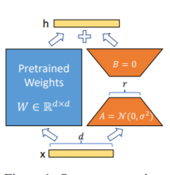

<p align="center">    </p>
<h4 align="center">
A Unified and Efficient Approach for Large
Language Model Inference Serving
</h4>

---
## About

UELLM is a unified and efficient approach for LLM inference serving.

UELLM is fast with:

- State-of-the-art serving throughput
- Deploy efficiently LLM according to the current actual situation
- Reasonably combine batch requests to reduce redundant kvache
- Efficiently schedule inference requests to reduce SLO default rate

## Getting Started

####  1. Quick experience

```bash
cd path/to/UELLM.cpp
g++ UELLM.cpp -o UELLM
./UELLM
```


#### 2. Experience an algorithm alone

```shell
conda create -n uellm python=3.10
conda activate uellm
pip install requirements.txt
```

- **batching algorithm**

  ```shell
  cd path/to/experiment
  cd batch_algorithm
  python SLO-ODBS.py #you can choose algorithm which you like
  ```

- **LLM deployment algorithm**

  ```shell
  cd path/to/experiment
  cd llm_deployment
  python helr.py #you can choose algorithm which you like
  ```

- **UELLM-all & UELLM-batch & UELLM UELLM-deploy**

  ```shell
  cd path/to/experiment
  cd [UELLM-all|UELLM-batch|UELLM UELLM-deploy]
  python [all.py|batch.py|deploy.py] 
  ```

- **$S^3$ & Morphling**

  ```shell
  cd path/to/experiment
  cd [s3|morphling]
  python [s3.py|morphling.py] 
  ```

  

## one more thing

**We have also open sourced our fine-tuned LLM data set and related scripts. You can quickly fine-tune your own model according to the following process.**

```shell
cd finetuning
pip install requirements.txt
```

When fine-tuning the model, if you encounter insufficient video memory, you can turn on gradient_checkpointing, zero3, offload and other parameters to save video memory.

The model_name_or_path parameter below is the model path. Please modify it according to your actual model saving address.

#### 1. Freeze

Freeze method, that is, parameter freezing, freezes some parameters of the original model and only trains some parameters, so that large models can be trained on a single card or multiple cards without performing TP or PP operations.

For fine-tuning code, see `train.py`. The core part is as follows:

```python3
freeze_module_name = args.freeze_module_name.split(",")
for name, param in model.named_parameters():
	if not any(nd in name for nd in freeze_module_name):
		param.requires_grad = False
```

To modify different layers of the model, you can modify the freeze_module_name parameter configuration yourself, such as "layers.27.,layers.26.,layers.25.,layers.24.".
The training codes are all trained using DeepSpeed. The parameters that can be set include: 

`train_path`, `model_name_or_path`, `mode`,` train_type`, `freeze_module_name`,`ds_file`, `num_train_epochs`, `per_device_train_batch_size`, `gradient_accumulation_steps`, `output_dir`, etc., which can be configured according to your own tasks.

**ChatGLM single card training**

```
CUDA_VISIBLE_DEVICES=0 deepspeed --master_port 520 train.py \
                --train_path data/spo_0.json \
                --model_name_or_path ChatGLM-6B/ \
                --per_device_train_batch_size 1 \
                --max_len 1560 \
                --max_src_len 1024 \
                --learning_rate 1e-4 \
                --weight_decay 0.1 \
                --num_train_epochs 2 \
                --gradient_accumulation_steps 4 \
                --warmup_ratio 0.1 \
                --mode glm \
                --train_type freeze \
                --freeze_module_name "layers.27.,layers.26.,layers.25.,layers.24." \
                --seed 1234 \
                --ds_file ds_zero2_no_offload.json \
                --gradient_checkpointing \
                --show_loss_step 10 \
                --output_dir ./output-glm
```

**ChatGLM four-card training** uses `CUDA_VISIBLE_DEVICES` to control which specific cards are used for training. If this parameter is not added, it means that all cards on the running machine are used for training.

```
CUDA_VISIBLE_DEVICES=0,1,2,3 deepspeed --master_port 520 train.py \
                --train_path data/spo_0.json \
                --model_name_or_path ChatGLM-6B/ \
                --per_device_train_batch_size 1 \
                --max_len 1560 \
                --max_src_len 1024 \
                --learning_rate 1e-4 \
                --weight_decay 0.1 \
                --num_train_epochs 2 \
                --gradient_accumulation_steps 4 \
                --warmup_ratio 0.1 \
                --mode glm \
                --train_type freeze \
                --freeze_module_name "layers.27.,layers.26.,layers.25.,layers.24." \
                --seed 1234 \
                --ds_file ds_zero2_no_offload.json \
                --gradient_checkpointing \
                --show_loss_step 10 \
                --output_dir ./output-glm
```

**ChatGLM2 single card training**

```
CUDA_VISIBLE_DEVICES=0 deepspeed --master_port 520 train.py \
                --train_path data/spo_0.json \
                --model_name_or_path ChatGLM2-6B/ \
                --per_device_train_batch_size 1 \
                --max_len 1560 \
                --max_src_len 1024 \
                --learning_rate 1e-4 \
                --weight_decay 0.1 \
                --num_train_epochs 2 \
                --gradient_accumulation_steps 4 \
                --warmup_ratio 0.1 \
                --mode glm2 \
                --train_type freeze \
                --freeze_module_name "layers.27.,layers.26.,layers.25.,layers.24." \
                --seed 1234 \
                --ds_file ds_zero2_no_offload.json \
                --gradient_checkpointing \
                --show_loss_step 10 \
                --output_dir ./output-glm2
```

**ChatGLM2 four-card training** uses `CUDA_VISIBLE_DEVICES` to control which specific cards are used for training. If this parameter is not added, it means that all cards on the running machine are used for training.

```
CUDA_VISIBLE_DEVICES=0,1,2,3 deepspeed --master_port 520 train.py \
                --train_path data/spo_0.json \
                --model_name_or_path ChatGLM2-6B/ \
                --per_device_train_batch_size 1 \
                --max_len 1560 \
                --max_src_len 1024 \
                --learning_rate 1e-4 \
                --weight_decay 0.1 \
                --num_train_epochs 2 \
                --gradient_accumulation_steps 4 \
                --warmup_ratio 0.1 \
                --mode glm2 \
                --train_type freeze \
                --freeze_module_name "layers.27.,layers.26.,layers.25.,layers.24." \
                --seed 1234 \
                --ds_file ds_zero2_no_offload.json \
                --gradient_checkpointing \
                --show_loss_step 10 \
                --output_dir ./output-glm2
```

**ChatGLM3 single card training**

```
CUDA_VISIBLE_DEVICES=0 deepspeed --master_port 520 train.py \
                --train_path data/spo_0.json \
                --model_name_or_path ChatGLM3-6B/ \
                --per_device_train_batch_size 1 \
                --max_len 1560 \
                --max_src_len 1024 \
                --learning_rate 1e-4 \
                --weight_decay 0.1 \
                --num_train_epochs 2 \
                --gradient_accumulation_steps 4 \
                --warmup_ratio 0.1 \
                --mode glm3 \
                --train_type freeze \
                --freeze_module_name "layers.27.,layers.26.,layers.25.,layers.24." \
                --seed 1234 \
                --ds_file ds_zero2_no_offload.json \
                --gradient_checkpointing \
                --show_loss_step 10 \
                --output_dir ./output-glm3
```

**ChatGLM3 four-card training** uses `CUDA_VISIBLE_DEVICES` to control which specific cards are used for training. If this parameter is not added, it means that all cards on the running machine are used for training.

```
CUDA_VISIBLE_DEVICES=0,1,2,3 deepspeed --master_port 520 train.py \
                --train_path data/spo_0.json \
                --model_name_or_path ChatGLM3-6B/ \
                --per_device_train_batch_size 1 \
                --max_len 1560 \
                --max_src_len 1024 \
                --learning_rate 1e-4 \
                --weight_decay 0.1 \
                --num_train_epochs 2 \
                --gradient_accumulation_steps 4 \
                --warmup_ratio 0.1 \
                --mode glm3 \
                --train_type freeze \
                --freeze_module_name "layers.27.,layers.26.,layers.25.,layers.24." \
                --seed 1234 \
                --ds_file ds_zero2_no_offload.json \
                --gradient_checkpointing \
                --show_loss_step 10 \
                --output_dir ./output-glm3
```

> **PS: ChatGLM uses more memory than ChatGLM2 during fine-tuning. The detailed memory ratio is as follows:**

| Model   | DeepSpeed-Stage | Offload | Gradient Checkpointing | Batch Size | Max Length | GPU-A40 Number | memory consumed |
| ------- | --------------- | ------- | ---------------------- | ---------- | ---------- | -------------- | --------------- |
| ChaGLM  | zero2           | No      | Yes                    | 1          | 1560       | 1              | 36G             |
| ChaGLM  | zero2           | No      | No                     | 1          | 1560       | 1              | 38G             |
| ChaGLM  | zero2           | No      | Yes                    | 1          | 1560       | 4              | 24G             |
| ChaGLM  | zero2           | No      | No                     | 1          | 1560       | 4              | 29G             |
| ChaGLM2 | zero2           | No      | Yes                    | 1          | 1560       | 1              | 35G             |
| ChaGLM2 | zero2           | No      | No                     | 1          | 1560       | 1              | 36G             |
| ChaGLM2 | zero2           | No      | Yes                    | 1          | 1560       | 4              | 22G             |
| ChaGLM2 | zero2           | No      | No                     | 1          | 1560       | 4              | 27G             |

#### 2. PT

The PT method, that is, the P-Tuning method, refer to [ChatGLM official code](https://github.com/THUDM/ChatGLM-6B/blob/main/ptuning/README.md), which is a soft method for large models. -prompt method.


- P-Tuning only adds new parameters to the Embedding of large models. [paper](https://arxiv.org/abs/2103.10385)
- P-Tuning-V2, adds new parameters to the Embedding of large models and before each layer. [paper](https://arxiv.org/abs/2110.07602)

For fine-tuning code, see `train.py`. The core part is as follows:

```python3
config = MODE[args.mode]["config"].from_pretrained(args.model_name_or_path)
config.pre_seq_len = args.pre_seq_len
config.prefix_projection = args.prefix_projection
model = MODE[args.mode]["model"].from_pretrained(args.model_name_or_path, config=config)
for name, param in model.named_parameters():
	if not any(nd in name for nd in ["prefix_encoder"]):
		param.requires_grad = False
```

When prefix_projection is True, it is the P-Tuning-V2 method, and new parameters are added to the Embedding of the large model and before each layer; when it is False, it is the P-Tuning method, and new parameters are added only to the Embedding of the large model. parameter.

The training codes are all trained using DeepSpeed. The parameters that can be set include train_path, model_name_or_path, mode, train_type, pre_seq_len, prefix_projection, ds_file, num_train_epochs, per_device_train_batch_size, gradient_accumulation_steps, output_dir, etc., which can be configured according to your own tasks.

**ChatGLM single card training**

```
CUDA_VISIBLE_DEVICES=0 deepspeed --master_port 520 train.py \
                --train_path data/spo_0.json \
                --model_name_or_path ChatGLM-6B \
                --per_device_train_batch_size 1 \
                --max_len 768 \
                --max_src_len 512 \
                --learning_rate 1e-4 \
                --weight_decay 0.1 \
                --num_train_epochs 2 \
                --gradient_accumulation_steps 4 \
                --warmup_ratio 0.1 \
                --mode glm \
                --train_type ptuning \
                --seed 1234 \
                --ds_file ds_zero2_no_offload.json \
                --gradient_checkpointing \
                --show_loss_step 10 \
                --pre_seq_len 16 \
                --prefix_projection True \
                --output_dir ./output-glm
```

**ChatGLM four-card training** uses `CUDA_VISIBLE_DEVICES` to control which specific cards are used for training. If this parameter is not added, it means that all cards on the running machine are used for training.

```
CUDA_VISIBLE_DEVICES=0,1,2,3 deepspeed --master_port 520 train.py \
                --train_path data/spo_0.json \
                --model_name_or_path ChatGLM-6B \
                --per_device_train_batch_size 1 \
                --max_len 1560 \
                --max_src_len 1024 \
                --learning_rate 1e-4 \
                --weight_decay 0.1 \
                --num_train_epochs 2 \
                --gradient_accumulation_steps 4 \
                --warmup_ratio 0.1 \
                --mode glm \
                --train_type ptuning \
                --seed 1234 \
                --ds_file ds_zero2_no_offload.json \
                --gradient_checkpointing \
                --show_loss_step 10 \
                --pre_seq_len 16 \
                --prefix_projection True \
                --output_dir ./output-glm
```

**ChatGLM2 single card training**

```
CUDA_VISIBLE_DEVICES=0 deepspeed --master_port 520 train.py \
                --train_path data/spo_0.json \
                --model_name_or_path ChatGLM2-6B \
                --per_device_train_batch_size 1 \
                --max_len 1560 \
                --max_src_len 1024 \
                --learning_rate 1e-4 \
                --weight_decay 0.1 \
                --num_train_epochs 2 \
                --gradient_accumulation_steps 4 \
                --warmup_ratio 0.1 \
                --mode glm2 \
                --train_type ptuning \
                --seed 1234 \
                --ds_file ds_zero2_no_offload.json \
                --gradient_checkpointing \
                --show_loss_step 10 \
                --pre_seq_len 16 \
                --prefix_projection True \
                --output_dir ./output-glm2
```

**ChatGLM2 four-card training** uses `CUDA_VISIBLE_DEVICES` to control which specific cards are used for training. If this parameter is not added, it means that all cards on the running machine are used for training.

```
CUDA_VISIBLE_DEVICES=0,1,2,3 deepspeed --master_port 520 train.py \
                --train_path data/spo_0.json \
                --model_name_or_path ChatGLM2-6B \
                --per_device_train_batch_size 1 \
                --max_len 1560 \
                --max_src_len 1024 \
                --learning_rate 1e-4 \
                --weight_decay 0.1 \
                --num_train_epochs 2 \
                --gradient_accumulation_steps 4 \
                --warmup_ratio 0.1 \
                --mode glm2 \
                --train_type ptuning \
                --seed 1234 \
                --ds_file ds_zero2_no_offload.json \
                --gradient_checkpointing \
                --show_loss_step 10 \
                --pre_seq_len 16 \
                --prefix_projection True \
                --output_dir ./output-glm2
```

**ChatGLM3 single card training**

```
CUDA_VISIBLE_DEVICES=0 deepspeed --master_port 520 train.py \
                --train_path data/spo_0.json \
                --model_name_or_path ChatGLM3-6B/ \
                --per_device_train_batch_size 1 \
                --max_len 1560 \
                --max_src_len 1024 \
                --learning_rate 1e-4 \
                --weight_decay 0.1 \
                --num_train_epochs 2 \
                --gradient_accumulation_steps 4 \
                --warmup_ratio 0.1 \
                --mode glm3 \
                --train_type ptuning \
                --seed 1234 \
                --ds_file ds_zero2_no_offload.json \
                --gradient_checkpointing \
                --show_loss_step 10 \
                --pre_seq_len 16 \
                --prefix_projection True \
                --output_dir ./output-glm3
```

**ChatGLM3 four-card training** uses `CUDA_VISIBLE_DEVICES` to control which specific cards are used for training. If this parameter is not added, it means that all cards on the running machine are used for training.

```
CUDA_VISIBLE_DEVICES=0,1,2,3 deepspeed --master_port 520 train.py \
                --train_path data/spo_0.json \
                --model_name_or_path ChatGLM3-6B/ \
                --per_device_train_batch_size 1 \
                --max_len 1560 \
                --max_src_len 1024 \
                --learning_rate 1e-4 \
                --weight_decay 0.1 \
                --num_train_epochs 2 \
                --gradient_accumulation_steps 4 \
                --warmup_ratio 0.1 \
                --mode glm3 \
                --train_type ptuning \
                --seed 1234 \
                --ds_file ds_zero2_no_offload.json \
                --gradient_checkpointing \
                --show_loss_step 10 \
                --pre_seq_len 16 \
                --prefix_projection True \
                --output_dir ./output-glm3
```

>  **PS: ChatGLM uses more memory than ChatGLM2 during fine-tuning. The detailed  memory ratio is as follows:**

| Model   | DeepSpeed-Stage | Offload | Gradient Checkpointing | Batch Size | Max Length | GPU-A40 Number | memory consumed |
| ------- | --------------- | ------- | ---------------------- | ---------- | ---------- | -------------- | --------------- |
| ChaGLM  | zero2           | No      | Yes                    | 1          | 768        | 1              | 43G             |
| ChaGLM  | zero2           | No      | No                     | 1          | 300        | 1              | 44G             |
| ChaGLM  | zero2           | No      | Yes                    | 1          | 1560       | 4              | 37G             |
| ChaGLM  | zero2           | No      | No                     | 1          | 1360       | 4              | 44G             |
| ChaGLM2 | zero2           | No      | Yes                    | 1          | 1560       | 1              | 20G             |
| ChaGLM2 | zero2           | No      | No                     | 1          | 1560       | 1              | 40G             |
| ChaGLM2 | zero2           | No      | Yes                    | 1          | 1560       | 4              | 19G             |
| ChaGLM2 | zero2           | No      | No                     | 1          | 1560       | 4              | 39G             |

#### 3. Lora

The Lora method is to add additional low-rank matrices in parallel to specified parameters (weight matrices) on a large language model, and during the model training process, only train the parameters of the additional parallel low-rank matrices.
When the "rank value" is much smaller than the original parameter dimension, the amount of new low-rank matrix parameters will be very small. When tuning downstream tasks, only small parameters need to be trained, but better performance results can be obtained.



- Paper: [paper](https://arxiv.org/abs/2106.09685)
- Official code: [Github](https://github.com/microsoft/LoRA)
- peft library encapsulated by HuggingFace: [Github](https://github.com/huggingface/peft)

For fine-tuning code, see `train.py`. The core part is as follows:

```python3
model = MODE[args.mode]["model"].from_pretrained(args.model_name_or_path)
lora_module_name = args.lora_module_name.split(",")
config = LoraConfig(r=args.lora_dim,
					lora_alpha=args.lora_alpha,
					target_modules=lora_module_name,
					lora_dropout=args.lora_dropout,
					bias="none",
					task_type="CAUSAL_LM",
					inference_mode=False,
					)
model = get_peft_model(model, config)
model.config.torch_dtype = torch.float32
```

> PS: After Lora training, please merge parameters first and then perform model prediction.

The training codes are all trained using DeepSpeed. The parameters that can be set include train_path, model_name_or_path, mode, train_type, lora_dim, lora_alpha, lora_dropout, lora_module_name, ds_file, num_train_epochs, per_device_train_batch_size, gradient_accumulation_steps, output_dir, etc., which can be configured according to your own tasks.

**ChatGLM single card training**

```
CUDA_VISIBLE_DEVICES=0 deepspeed --master_port 520 train.py \
              --train_path data/spo_0.json \
              --model_name_or_path ChatGLM-6B \
              --per_device_train_batch_size 1 \
              --max_len 1560 \
              --max_src_len 1024 \
              --learning_rate 1e-4 \
              --weight_decay 0.1 \
              --num_train_epochs 2 \
              --gradient_accumulation_steps 4 \
              --warmup_ratio 0.1 \
              --mode glm \
              --train_type lora \
              --lora_dim 16 \
              --lora_alpha 64 \
              --lora_dropout 0.1 \
              --lora_module_name "query_key_value" \
              --seed 1234 \
              --ds_file ds_zero2_no_offload.json \
              --gradient_checkpointing \
              --show_loss_step 10 \
              --output_dir ./output-glm
```

**ChatGLM four-card training** uses `CUDA_VISIBLE_DEVICES` to control which specific cards are used for training. If this parameter is not added, it means that all cards on the running machine are used for training.

```
CUDA_VISIBLE_DEVICES=0,1,2,3 deepspeed --master_port 520 train.py \
              --train_path data/spo_0.json \
              --model_name_or_path ChatGLM-6B \
              --per_device_train_batch_size 1 \
              --max_len 1560 \
              --max_src_len 1024 \
              --learning_rate 1e-4 \
              --weight_decay 0.1 \
              --num_train_epochs 2 \
              --gradient_accumulation_steps 4 \
              --warmup_ratio 0.1 \
              --mode glm \
              --train_type lora \
              --lora_dim 16 \
              --lora_alpha 64 \
              --lora_dropout 0.1 \
              --lora_module_name "query_key_value" \
              --seed 1234 \
              --ds_file ds_zero2_no_offload.json \
              --gradient_checkpointing \
              --show_loss_step 10 \
              --output_dir ./output-glm
```

**ChatGLM2 single card training**

```
CUDA_VISIBLE_DEVICES=0 deepspeed --master_port 520 train.py \
              --train_path data/spo_0.json \
              --model_name_or_path ChatGLM2-6B \
              --per_device_train_batch_size 1 \
              --max_len 1560 \
              --max_src_len 1024 \
              --learning_rate 1e-4 \
              --weight_decay 0.1 \
              --num_train_epochs 2 \
              --gradient_accumulation_steps 4 \
              --warmup_ratio 0.1 \
              --mode glm2 \
              --train_type lora \
              --lora_dim 16 \
              --lora_alpha 64 \
              --lora_dropout 0.1 \
              --lora_module_name "query_key_value,dense_h_to_4h,dense_4h_to_h,dense" \
              --seed 1234 \
              --ds_file ds_zero2_no_offload.json \
              --gradient_checkpointing \
              --show_loss_step 10 \
              --output_dir ./output-glm2
```

**ChatGLM2 four-card training** uses `CUDA_VISIBLE_DEVICES` to control which specific cards are used for training. If this parameter is not added, it means that all cards on the running machine are used for training.

```
CUDA_VISIBLE_DEVICES=0,1,2,3 deepspeed --master_port 520 train.py \
              --train_path data/spo_0.json \
              --model_name_or_path ChatGLM2-6B \
              --per_device_train_batch_size 1 \
              --max_len 1560 \
              --max_src_len 1024 \
              --learning_rate 1e-4 \
              --weight_decay 0.1 \
              --num_train_epochs 2 \
              --gradient_accumulation_steps 4 \
              --warmup_ratio 0.1 \
              --mode glm2 \
              --train_type lora \
              --lora_dim 16 \
              --lora_alpha 64 \
              --lora_dropout 0.1 \
              --lora_module_name "query_key_value,dense_h_to_4h,dense_4h_to_h,dense" \
              --seed 1234 \
              --ds_file ds_zero2_no_offload.json \
              --gradient_checkpointing \
              --show_loss_step 10 \
              --output_dir ./output-glm2
```

**ChatGLM3 single card training**

```
CUDA_VISIBLE_DEVICES=0 deepspeed --master_port 520 train.py \
                --train_path data/spo_0.json \
                --model_name_or_path ChatGLM3-6B/ \
                --per_device_train_batch_size 1 \
                --max_len 1560 \
                --max_src_len 1024 \
                --learning_rate 1e-4 \
                --weight_decay 0.1 \
                --num_train_epochs 2 \
                --gradient_accumulation_steps 4 \
                --warmup_ratio 0.1 \
                --mode glm3 \
                --lora_dim 16 \
                --lora_alpha 64 \
                --lora_dropout 0.1 \
                --lora_module_name "query_key_value,dense_h_to_4h,dense_4h_to_h,dense" \
                --seed 1234 \
                --ds_file ds_zero2_no_offload.json \
                --gradient_checkpointing \
                --show_loss_step 10 \
                --output_dir ./output-glm3
```

**ChatGLM2 four-card training** uses `CUDA_VISIBLE_DEVICES` to control which specific cards are used for training. If this parameter is not added, it means that all cards on the running machine are used for training.

```
CUDA_VISIBLE_DEVICES=0,1,2,3 deepspeed --master_port 520 train.py \
                --train_path data/spo_0.json \
                --model_name_or_path ChatGLM3-6B/ \
                --per_device_train_batch_size 1 \
                --max_len 1560 \
                --max_src_len 1024 \
                --learning_rate 1e-4 \
                --weight_decay 0.1 \
                --num_train_epochs 2 \
                --gradient_accumulation_steps 4 \
                --warmup_ratio 0.1 \
                --mode glm3 \
                --lora_dim 16 \
                --lora_alpha 64 \
                --lora_dropout 0.1 \
                --lora_module_name "query_key_value,dense_h_to_4h,dense_4h_to_h,dense" \
                --seed 1234 \
                --ds_file ds_zero2_no_offload.json \
                --gradient_checkpointing \
                --show_loss_step 10 \
                --output_dir ./output-glm3
```

> PS: ChatGLM uses more memory than ChatGLM2 during fine-tuning. The detailed memory ratio is as follows:

| Model   | DeepSpeed-Stage | Offload | Gradient Checkpointing | Batch Size | Max Length | GPU-A40 Number | memory consumed |
| ------- | --------------- | ------- | ---------------------- | ---------- | ---------- | -------------- | --------------- |
| ChaGLM  | zero2           | No      | Yes                    | 1          | 1560       | 1              | 20G             |
| ChaGLM  | zero2           | No      | No                     | 1          | 1560       | 1              | 45G             |
| ChaGLM  | zero2           | No      | Yes                    | 1          | 1560       | 4              | 20G             |
| ChaGLM  | zero2           | No      | No                     | 1          | 1560       | 4              | 45G             |
| ChaGLM2 | zero2           | No      | Yes                    | 1          | 1560       | 1              | 20G             |
| ChaGLM2 | zero2           | No      | No                     | 1          | 1560       | 1              | 43G             |
| ChaGLM2 | zero2           | No      | Yes                    | 1          | 1560       | 4              | 19G             |
| ChaGLM2 | zero2           | No      | No                     | 1          | 1560       | 4              | 42G             |

**Note: The Lora method only saves the Lora training parameters when saving the model, so the model parameters need to be merged when predicting the model. For details, refer to `merge_lora.py`.**

#### 4.Full-parameter method

The full-parameter method performs full parameter training on large models. It mainly uses the **DeepSpeed-Zero3** method to divide the model parameters into multiple cards, and uses the Offload method to offload the optimizer parameters to the CPU to solve the problem of insufficient graphics cards.

For fine-tuning code, see `train.py`. The core part is as follows:

```python3
model = MODE[args.mode]["model"].from_pretrained(args.model_name_or_path)
```

The training codes are all trained using DeepSpeed. The parameters that can be set include train_path, model_name_or_path, mode, train_type, ds_file, num_train_epochs, per_device_train_batch_size, gradient_accumulation_steps, output_dir, etc., which can be configured according to your own tasks.

**ChatGLM four-card training** uses `CUDA_VISIBLE_DEVICES` to control which specific cards are used for training. If this parameter is not added, it means that all cards on the running machine are used for training.

```
CUDA_VISIBLE_DEVICES=0,1,2,3 deepspeed --master_port 520 train.py \
              --train_path data/spo_0.json \
              --model_name_or_path ChatGLM-6B \
              --per_device_train_batch_size 1 \
              --max_len 1560 \
              --max_src_len 1024 \
              --learning_rate 1e-4 \
              --weight_decay 0.1 \
              --num_train_epochs 2 \
              --gradient_accumulation_steps 4 \
              --warmup_ratio 0.1 \
              --mode glm \
              --train_type all \
              --seed 1234 \
              --ds_file ds_zero3_offload.json \
              --gradient_checkpointing \
              --show_loss_step 10 \
              --output_dir ./output-glm
```

**ChatGLM2 four-card training** uses `CUDA_VISIBLE_DEVICES` to control which specific cards are used for training. If this parameter is not added, it means that all cards on the running machine are used for training.

```
CUDA_VISIBLE_DEVICES=0,1,2,3 deepspeed --master_port 520 train.py \
              --train_path data/spo_0.json \
              --model_name_or_path ChatGLM2-6B \
              --per_device_train_batch_size 1 \
              --max_len 1560 \
              --max_src_len 1024 \
              --learning_rate 1e-4 \
              --weight_decay 0.1 \
              --num_train_epochs 2 \
              --gradient_accumulation_steps 4 \
              --warmup_ratio 0.1 \
              --mode glm2 \
              --train_type all \
              --seed 1234 \
              --ds_file ds_zero3_no_offload.json \
              --gradient_checkpointing \
              --show_loss_step 10 \
              --output_dir ./output-glm2
```

**ChatGLM3 four-card training** uses `CUDA_VISIBLE_DEVICES` to control which specific cards are used for training. If this parameter is not added, it means that all cards on the running machine are used for training.

```
CCUDA_VISIBLE_DEVICES=0,1,2,3 deepspeed --master_port 520 train.py \
              --train_path data/spo_0.json \
              --model_name_or_path ChatGLM3-6B \
              --per_device_train_batch_size 1 \
              --max_len 1560 \
              --max_src_len 1024 \
              --learning_rate 1e-4 \
              --weight_decay 0.1 \
              --num_train_epochs 2 \
              --gradient_accumulation_steps 4 \
              --warmup_ratio 0.1 \
              --mode glm3 \
              --train_type all \
              --seed 1234 \
              --ds_file ds_zero3_no_offload.json \
              --gradient_checkpointing \
              --show_loss_step 10 \
              --output_dir ./output-glm3
```

> PS: ChatGLM uses more memory than ChatGLM2 during fine-tuning. The detailed memory ratio is as follows:

| Model   | DeepSpeed-Stage | Offload | Gradient Checkpointing | Batch Size | Max Length | GPU-A40 Number | memory consumed |
| ------- | --------------- | ------- | ---------------------- | ---------- | ---------- | -------------- | --------------- |
| ChaGLM  | zero3           | Yes     | Yes                    | 1          | 1560       | 4              | 33G             |
| ChaGLM2 | zero3           | No      | Yes                    | 1          | 1560       | 4              | 44G             |
| ChaGLM2 | zero3           | Yes     | Yes                    | 1          | 1560       | 4              | 26G             |


